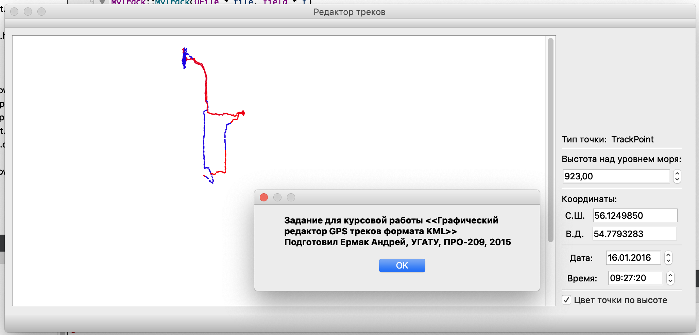

# GPS track viewer

## This is my OOP course work in 2th year in USATU (Ufa Aviation University) (2015 year)

Main features:

* Shows gps track (accepts base .kml format)
* Allows to modify height, coords and time of every track point
* Marked every track point by colour based on its height
* Allows to add custom single points (like favourite)
* Could save track
* Shows height-by-time and speed-by-time charts

The repository contains two copies of the project:

* `original` directory contains non changed files since 2015
* `changed` directory should contain refactored version

## Screenshot

